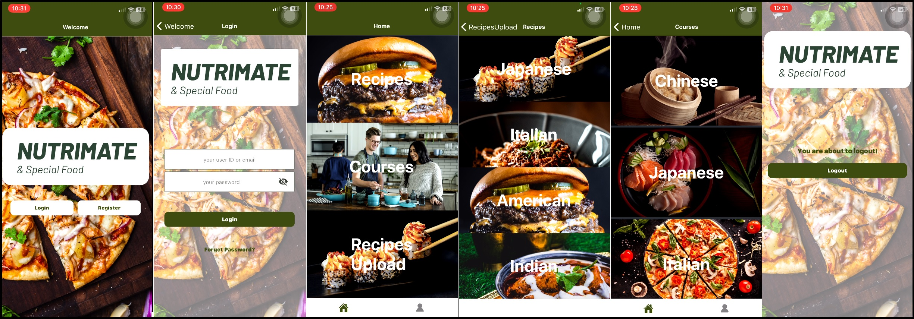

### Project Overview

This repository contains an advanced version of a project originally developed as part of a collaborative effort for the SCTP Software Engineering course at NTU School of Computer Science and Engineering.

Originally designed and implemented as a group project by a team of four developers, this version includes my individual contributions and improvements made post-project phase. These updates showcase my ability to optimize, expand, and manage full-stack development projects, taking them from their initial phase to mature, deployable applications.

### How we worked on this project

Our goal was to simulate a professional work environment.

- We worked with tasks on a Kanban board: [ScreenRecord of tasks](https://drive.google.com/file/d/1msQlCsGaTrRJ9EYak9b27cK5DP8gFaxV/view?usp=share_link)
- We used feature branches and Pull Requests: [Example PR](https://drive.google.com/file/d/1OSWOYE9Ixy8lMH09oJlGww0KBnNHqzLt/view?usp=share_link)

### How to navigate this project

This project is split into 3 parts:

- Frontend
- Backend
- Mobile

##### Frontend

- Use of useEffect and useState: [Example code](frontend/src/pages/MyFeedPage.js)
- Use of useContext defined in [AuthContext.js](frontend/src/context/AuthContext.js) which is used to provide state in [App.js](App.js) and consumed in [SignInPage.js](frontend/src/pages/SignInPage.js) and [Navbar.js](frontend/src/components/Navbar.js)
- Use of custom CSS: [Example code](frontend/src/App.css)
- The application fetches data from Spoonacular API: Example for the [request](frontend/src/App.js)
- Responsive CSS: [Example code](frontend/src/components/Carousel.module.css)
- Use of Routes: [Example code](frontend/src/App.js)
- Use of firestore as database: [Example code](frontend/src/pages/RegisterPage.js)
- Pagination: [Example code](frontend/src/components/RecipeCard.js)

[Screen Recording of Web Application](https://drive.google.com/file/d/1dWSieaCiTPpe7BpC_SlZA3W1f1JorxXJ/view?usp=sharing)

##### Backend

- Use of Java's framework SpringBoot
- Use of annotations @RestController, @GetMapping, @PostMapping, @PutMapping and DeleteMapping: [Example code](backend/src/main/java/sg/edu/ntu/nutrimate/controller/RecipeController.java)
- Use of inheritance (Principles of Object-Oriented programming): [Example code](backend/src/main/java/sg/edu/ntu/nutrimate/entity/CustomerRecipe.java)
- Postman
- Deployment to Heroku

##### Mobile

- Use of Figma for wireframe prototyping [here](mobile/assets/figma/figma%20wireframe.jpeg)
- Use of React Native with Backend code
- Use of Axios to fetch recipe image and recipe title for recipeList screen [Example code](mobile/screen/RecipeList.js) and recipe details for recipeDetails screen [Example code](mobile/screen/RecipeDetails.js)
- Use of Firebase Storage to store customer uploaded recipe images [Example code](mobile/screen/RecipesUpload.js)
- Use of expo SDKs such as expo-camera, expo-image-picker and expo-file-system for user to upload recipe image [Example code](mobile/screen/RecipesUpload.js)

[Screen Recording of Mobile Application](https://drive.google.com/file/d/16lE38EgHvbDoUZEY2h5zdbDMy_WaUXlT/view?usp=sharing)

### Why was the project built this way

- The design of the web application was mainly from css libraries such as MDB react and Bootstrap as this project timeline was 1.5 weeks only. We wanted something that was already there for us to use.

### If I had more time during the project phase I would change this

- Refactor the code to use useContext as there is too much of props drilling involved in each component [here](frontend/src/App.js)

#### Additional libraries to install for Frontend Web Application:

npm install react-bootstrap bootstrap  
npm install react-router-dom  
npm i mdb-react-ui-kit  
npm i @fortawesome/fontawesome-free  
npm install --save mdbreact  
npm install @mui/material @emotion/react @emotion/styled  
npm install @mui/icons-material  
npm install axios  
npm i react-share  
npm install @material-ui/core  
npm install firebase  
npm install firebase@9.22.0 --save

#### Additional libraries to install for Mobile App:

npm install @react-navigation/native  
npx expo install react-native-screens react-native-safe-area-context  
npm install @react-navigation/native-stack  
npm install --save-prod react-native-render-html  
npx expo install expo-local-authentication  
npx expo install expo-camera  
npx expo install firebase  
npm install expo-image-loader
